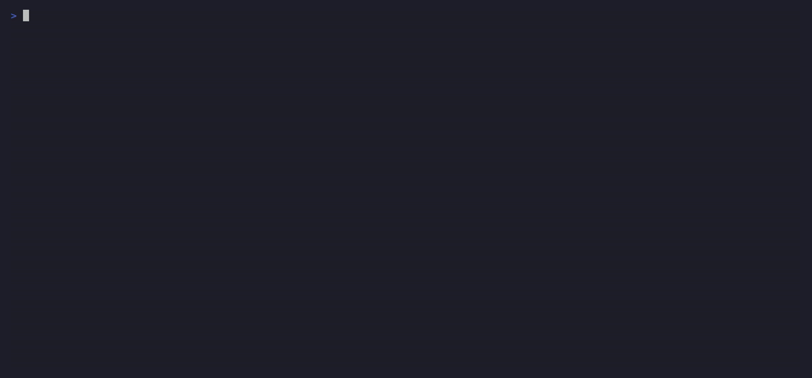
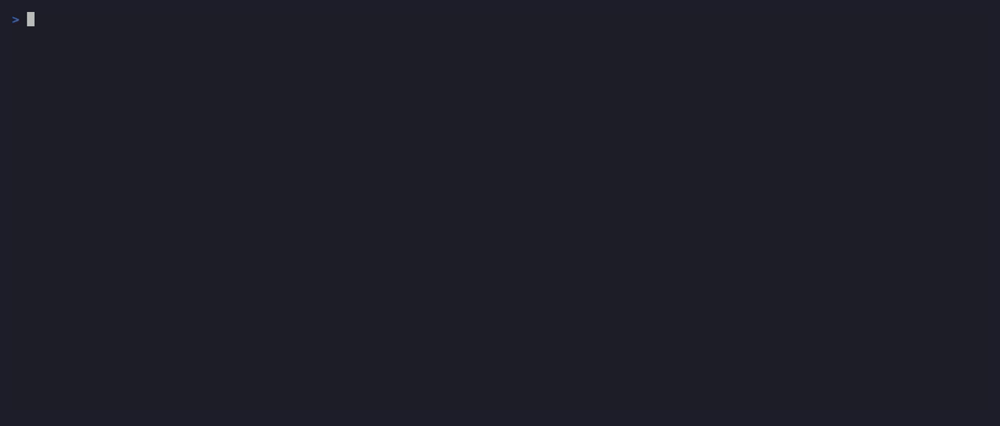
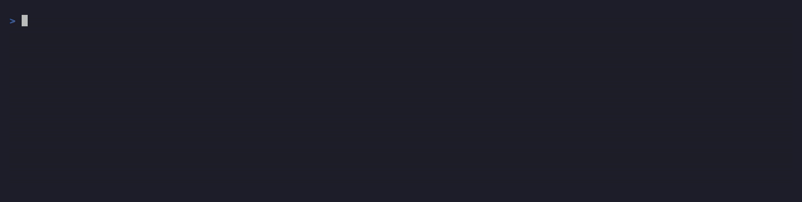

# s3tap

[](https://github.com/echemythia/s3tap/actions/workflows/ci.yml)
[](https://codecov.io/gh/echemythia/s3tap)
[](https://github.com/echemythia/s3tap/releases/latest)
[](LICENSE)

**Documentation:** <https://echemythia.github.io/s3tap/>

`s3tap` watches the [S3](https://aws.amazon.com/s3/) traffic going in and out of a
machine and turns it into clean, structured records: connections, DNS lookups, TLS
handshakes and decoded S3 operations, each with a breakdown of where the time went.
Your application never changes and never even knows it is being watched.

It does this with **[eBPF](https://ebpf.io/)**, a way to run small, safe programs inside
the Linux kernel. Those little programs collect the raw events. A companion program
written in Rust (using [aya](https://aya-rs.dev/)) reads them and stitches them into a
versioned, documented set of records.

**It doesn't care which S3 client you use.** To learn which bucket a connection is
talking to, it reads the server name from the first, still-unencrypted message of the
TLS handshake (the [SNI](https://en.wikipedia.org/wiki/Server_Name_Indication) field in
the [ClientHello](https://www.cloudflare.com/learning/ssl/what-happens-in-a-tls-handshake/)),
so Go, OpenSSL and BoringSSL clients all work the same way. If you want the full HTTP and
S3 detail, an optional mode hooks OpenSSL's
[`SSL_write`](https://docs.openssl.org/master/man3/SSL_write/) and
[`SSL_read`](https://docs.openssl.org/master/man3/SSL_read/) to read requests just before
they are encrypted. It also hooks the OpenSSL 1.1.1+ `SSL_write_ex` / `SSL_read_ex` pair,
which is what modern clients call, so Python's `ssl`, Node and anything built against
OpenSSL 3 are covered rather than silently yielding no HTTP layer.

**Contents:** [Status](#status) · [Demo](#demo) · [Requirements](#requirements) ·
[Install](#install) · [Quickstart](#quickstart) · [Privileges](#privileges) · [Usage](#usage) ·
[Why use it](#why-use-it) · [How it works](#how-it-works) ·
[Kernel-version support](#kernel-version-support) · [Build from source](#build-from-source) ·
[Development](#development) · [Layout](#layout) · [Security & privacy](#security--privacy) ·
[Disclaimer](#disclaimer) · [License](#license)

## Status

**Experimental (0.x).** s3tap is a personal project rather than drop-in operational
tooling. It is at the point where early users can get real answers out of it, provided
they are comfortable with Linux and eBPF when something needs a second look.

What that means in practice:

- **It needs privilege.** Capture loads eBPF programs, so it wants `CAP_BPF`,
  `CAP_PERFMON` and `CAP_DAC_READ_SEARCH`. The HTTP layer additionally wants
  `CAP_SYS_ADMIN` for the OpenSSL uprobes. Granting those is a decision rather than a
  formality. See [Security & privacy](#security--privacy).
- **It is Linux-only and kernel-sensitive.** Linux 5.8 or newer, with BTF. The supported
  range is verified by LOADING the probes on each kernel, which is a weaker claim than
  having exercised every path on each of them.
- **The HTTP layer depends on your TLS library.** OpenSSL clients (curl, Python, the AWS
  CLI) decode fully. Go and rustls clients still give connections, SNI and the network
  picture, but no S3 operations.
- **Interfaces are settled rather than frozen.** The record schemas are versioned and the
  exit codes are documented, which is what makes a 0.x honest: stable enough to script
  against, still free to change under a version bump.

The [Disclaimer](#disclaimer) below is the short version. It is the one that governs.

## Demo

Three questions, three commands. Click one to play its demo. Every command reads the same
records, so a capture taken once can be judged offline with no privileges.

<details open>
<summary><b><code>s3tap doctor</code></b>  ·  is this capture healthy?</summary>



Every latency span is scored against the connection's round-trip floor, so it flags the HTTP
errors and calls a 4xx a client bug, not the network.

</details>

<details>
<summary><b><code>s3tap check</code></b>  ·  where do I sit, relative to S3?</summary>



Measured round-trip latency maps this host to S3's regions, nearest first, so you can tell a slow
network apart from a slow bucket before you dig in.

</details>

<details>
<summary><b><code>s3tap advise</code></b>  ·  how do I run faster and cheaper?</summary>



Advice on how the app uses S3: reuse connections, add parallelism, stop re-fetching unchanged
objects. Attributed per process.

</details>

## Requirements

- **Linux** kernel **≥ 5.8** built with **[BTF](https://docs.kernel.org/bpf/btf.html)**,
  built-in type information that lets s3tap run on different kernel versions without
  recompiling. Check for `/sys/kernel/btf/vmlinux`. It comes from `CONFIG_DEBUG_INFO_BTF=y`
  and is standard on modern distro kernels. The probes are verified to LOAD on v5.8, v5.15,
  v6.1, v6.8 and v6.16. `selftest` passes end to end on v5.8, v5.15, 6.8 and 6.12. See
  [Kernel-version support](#kernel-version-support).
- **x86_64 or aarch64** for the prebuilt binary; other architectures build from source.
- **Privileges to load eBPF**: run as root, or grant the binary file capabilities once. See
  [Privileges](#privileges).
- **To build from source**, additionally: `clang`, `llvm-strip`, `bpftool` (`libbpf-dev`), a
  stable **Rust** toolchain (see `rust-toolchain.toml`) and [`just`](https://just.systems).

The pure consumers (`doctor`, `advise`, `analyze`, `scorecard`) need none of this at run
time. They read records, so they want no kernel, no probes and no privilege.

## Install

**Prebuilt binary (Linux x86_64).** One self-contained file, no toolchain needed. This
downloads the latest release binary into `~/.local/bin` and verifies its checksum:

```sh
curl -fsSL https://raw.githubusercontent.com/echemythia/s3tap/main/install.sh | sh
```

That is enough for everything: the pure consumers need no privilege at all, and capture offers
to re-run itself under `sudo`. `S3TAP_BINDIR` picks a different directory if you want one.

Only [`setup`](#privileges) — the optional one-time capability grant that replaces the per-run
sudo prompt — cares where the binary lives, because it refuses to cap one on a user-writable
path.

**s3tap is Linux-only.** The consumer crates carry no eBPF dependency and build anywhere, but
the binary links `aya` unconditionally and compiles its eBPF object against a type header
generated from the build host's own kernel, so it does not build on macOS at all. Judging a
capture on a Mac means building the consumer crates into your own tool rather than running
this one.

## Quickstart

```sh
curl -fsSL https://raw.githubusercontent.com/echemythia/s3tap/main/install.sh | sh
s3tap check --map-only                                    # is the probe path healthy?
s3tap --capture-plaintext --format jsonl > capture.jsonl  # offers sudo, then captures
s3tap doctor --from capture.jsonl                         # no probes, no privilege
```

The default install goes to `~/.local/bin` and that is all you need. Loading eBPF needs
privilege, so the capture line offers to re-run itself under `sudo` — it re-execs by resolved
path, so it works wherever the binary lives. `doctor` reads the saved file and needs nothing.

If you capture often, granting the capabilities once is nicer than a password prompt per run.
That is what [`setup`](#privileges) is for, and it is the only reason to care where the binary
lives.

## Privileges

Loading eBPF needs privilege. You can run s3tap under `sudo` every time and grant nothing, or
tag the binary once with the capabilities it actually needs and run it as yourself afterwards.

`setup` refuses to cap a binary on a user-writable path, and the default `~/.local/bin` is one
— so granting means moving it to a root-owned path first. Delete the original when you do:
`~/.local/bin` usually precedes `/usr/local/bin` on `PATH`, so leaving it there means a bare
`s3tap` keeps running the ungranted copy and `setup` looks like it failed.

```sh
sudo install -m 0755 ~/.local/bin/s3tap /usr/local/bin/s3tap
rm ~/.local/bin/s3tap
sudo s3tap setup            # base capture: connections, wire DNS, SNI
sudo s3tap setup --uprobes  # + the L7 / TLS-plaintext path
sudo s3tap setup --remove   # revert the grant
```

To skip all of that, install straight to a root-owned path in the first place:
`curl -fsSL …/install.sh | sudo env S3TAP_BINDIR=/usr/local/bin sh`.

s3tap asks for a **least-privilege** set rather than blanket root:

- **`cap_bpf`** loads the eBPF programs and creates their maps and ring buffer.
- **`cap_perfmon`** attaches the kprobes and tracepoints and reads the kernel's own
  `tcp_sock` counters.
- **`cap_dac_read_search`** reads the BTF type information and probe paths regardless
  of file ownership.
- **`cap_sys_admin`** (only with `--uprobes`) attaches the userspace uprobes for the
  `getaddrinfo` resolver-latency and plaintext HTTP paths. It is near-root, so it stays
  opt-in.

The first three are the default capture. The fourth is added only when you opt into the
uprobe features: `--capture-plaintext`, `selftest`'s HTTP row and the L7 rows of `check` and
`doctor --live`.

### Why the install goes to a root-owned path

`setup` **refuses** to cap a binary a local user could rewrite: it requires the binary **and
every ancestor directory up to `/`** to be root-owned and not group- or world-writable, on the
symlink-resolved path. A build tree and the installer's default `~/.local/bin` both fail that
test, which is why the recipe above moves the binary first.

The refusal is not cosmetic. File capabilities belong to whoever can put bytes in that inode,
so capping a binary under a directory you can rename would hand `cap_sys_admin` to every local
user, along with the host-wide decrypted traffic it unlocks.

`./setcap.sh` is the equivalent shell path and applies the identical refusal. It carries one
opt-out for single-user dev boxes, `S3TAP_SETCAP_INSECURE=1 ./setcap.sh`, which caps the
build-tree binary in place after saying out loud what that costs. That opt-out exists only in
the script: `s3tap setup` has none, so the shell path can never become a quiet way around the
Rust guard.

> Capabilities live on the binary **inode**, which `cargo build` replaces. **Re-run `setup`
> after every rebuild.**

### If you skip the grant

s3tap detects that it lacks the privileges to load eBPF and offers to re-run itself under
`sudo` (sudo runs its own password prompt, so s3tap never sees your password). `--no-elevate`
disables the offer. CI and cron never hang on it: with no tty, s3tap prints the hint and fails
normally instead of prompting.

> **New to Linux capabilities?** They split the historically all-or-nothing root
> privilege into finer-grained units, so a process can hold only what it needs and
> nothing more. See [`capabilities(7)`](https://man7.org/linux/man-pages/man7/capabilities.7.html)
> for the full model and the meaning of each flag above.

> **New to uprobes?** A uprobe attaches an eBPF program to a function inside a
> user-space library, so s3tap can read `SSL_write`/`SSL_read` (decrypted HTTP) and
> time `getaddrinfo` (DNS resolver latency). It is the user-space counterpart to a
> kprobe. It fires host-wide for every process that uses the library, which is
> why it stays opt-in. See the kernel [uprobe-tracer docs](https://docs.kernel.org/trace/uprobetracer.html).

## Usage

The examples below call `s3tap` directly. If you have not put it on your `PATH`, use
the built binary at `./target/release/s3tap` instead.

### Health check

`check` is the 60-second answer to "is my S3 path healthy?". With no target it maps
this host's round-trip to 8 S3 regions, then health-checks the nearest one it has a
public test object for ([AWS Open Data](https://registry.opendata.aws/)) and ends in a plain-language verdict.

```sh
s3tap check                                          # map regions, then check the nearest
s3tap check --map-only                               # just the regional map (base caps only)
s3tap check my-bucket/some/key                       # a verdict on your own object and path
s3tap check my-bucket/key --auth --region eu-west-1  # a private bucket
s3tap check my-bucket/key --triage                   # add "how much RTT is avoidable?"
```

### Observe live traffic

Run `s3tap` with no subcommand to watch traffic as it happens. On a terminal it draws a
waterfall chart that lines up each phase of a request. When you pipe or redirect it, it
switches to [JSONL](https://jsonlines.org/) (one JSON object per line) so scripts get
clean, machine-readable output.

```sh
s3tap                          # waterfall on a tty, jsonl when redirected
s3tap --format table           # one fixed-width row per operation
s3tap --format jsonl           # raw records, one JSON object per line
```

A capture exits 0 even when it recorded nothing, because a quiet application is not an error.
The exception is a scope that missed, which exits 3: see [Exit codes](#exit-codes).

### Decode S3 operations

Decoding HTTP and S3 semantics is opt-in. It attaches host-wide `SSL_write`/`SSL_read`
uprobes that see decrypted bytes, including AWS credentials, so it needs `setup
--uprobes` and should be scoped carefully (see [Security and privacy](#security--privacy)).

```sh
s3tap --capture-plaintext --format waterfall
```

### Scope to one app, process, or container

Filtering happens in-kernel, before any out-of-scope data reaches userspace. Prefer exact
scopes when possible. `--app` is convenient, but weaker because it admits by executable
basename.

```sh
s3tap --exe /usr/bin/python3
s3tap --pid 1234
s3tap --container my-uploader
s3tap --app spark-executor
```

### Diagnose a capture's health

`doctor` reads records you've already captured and grades each timing against the
connection's best-case round-trip, then gives a healthy-or-not verdict. It only reads
data, with no probes and no special privileges. `check` above is just a guided, automated
front-end for it.

```sh
s3tap --format jsonl | s3tap doctor        # judge a live capture over a pipe
s3tap doctor --from capture.jsonl          # judge a saved capture
s3tap doctor --from capture.jsonl --brief  # one-line, plain-language verdict
s3tap doctor --from capture.jsonl --cost   # approximate S3 request-cost breakdown
```

The exit code is scriptable: see [Exit codes](#exit-codes).

Three of those codes are verdicts worth naming here, because a capture can look clean and still
support no conclusion. A capture that decoded no S3 request at all reports **NO OPERATIONS**,
which is what a Go or rustls client looks like, or any capture taken without the uprobe caps.
The network rows can be perfectly clean and still say nothing about S3. A capture whose
requests were decoded but never answered reports **NO RESPONSES**, the shape Ctrl-C
mid-workload leaves behind. A capture spanning multiple network paths can report
**MIXED PATHS** when no timing span can be judged against one honest round-trip floor. All
three exit 2 rather than reading as a pass.

### Get optimization advice

`advise` looks at how your application uses S3 (connection churn, missing parallelism,
redundant re-fetches, throttling and a caching go/no-go) and reports advice per
process. Health lives in `doctor`. This is the tuning layer on top of it.

```sh
s3tap --format jsonl | s3tap advise        # advice on a live capture
s3tap advise --from capture.jsonl          # advice on a saved capture
s3tap advise --from capture.jsonl --json   # structured advisories, one JSON per line
```

### Score what your traffic actually saw

`scorecard` rolls a capture up per bucket and S3 operation and reports the latency and
reliability you really got: request and error counts, the status-code mix and TTFB
p50/p95/p99. It is the passive version of a speedtest, built from your own production
requests rather than a synthetic probe. It is a report rather than a gate, so a scored capture
exits 0 unless you pass `--strict`. A capture that was read but held nothing scoreable exits 2
either way, on the same reasoning as the doctor's missing-denominator verdicts: no rows is not
a clean report.

```sh
s3tap scorecard --from capture.jsonl          # the per-bucket/op table
s3tap scorecard --from capture.jsonl --json   # scorecard rows plus findings, one JSON per line
```

### Study caching in depth

`analyze` runs the full offline caching study on one trace: the retention ladder (LRU,
ARC, S3-FIFO, OPT) plus the prefetch tradeoff, then recommends whether to cache, which
policy, at what size and whether prefetching helps. It is heavier than `advise`
(seconds to minutes).

```sh
s3tap analyze --from capture.jsonl         # the deep report
s3tap analyze --from capture.jsonl --fast  # retention only, much quicker
s3tap analyze --from capture.jsonl --json  # structured verdict, one JSON object
```

### Check it works on this host

`selftest` loads the probes, drives a few real S3 requests and asserts each
capability produced a record. It exits non-zero if TCP, TLS, or HTTP fail. DNS is
informational, since nscd-style resolvers query off-scope.

```sh
s3tap selftest
s3tap selftest --endpoint https://127.0.0.1:9000   # against a local MinIO with TLS, see below
```

The endpoint must be **HTTPS**. `selftest` asserts a TLS row and an HTTP row, and both come
from the TLS path. A plaintext endpoint produces neither, so `http://…` can only ever fail.

### Exit codes

The main capture and consumer verdict commands use one mapping, so a script can read the
number without knowing which consumer produced it.

| Code | Meaning |
|------|---------|
| **0** | Judged, with nothing to report. Also a capture that recorded nothing (a quiet app is not an error), `advise` without `--strict`, a scorecard report and `--cost`, none of which gate. |
| **1** | A **verdict about your traffic**: something sits outside its envelope. `--strict` widens it to advisories on `doctor`, `advise` and `scorecard`. |
| **2** | **Nothing could be judged.** No round-trip floor (NO BASELINE), no S3 request decoded (NO OPERATIONS), requests decoded but none answered (NO RESPONSES), a floor that spans two network paths so no span could be judged against it (MIXED PATHS), or nothing scoreable. Not `--strict`-gated: a run that judged nothing must not read green either way. |
| **3** | **Ran, captured nothing.** `--live` drove a workload and saw no records, or an `--app`/`--exe` scope matched no process at either end of the run. |
| **4** | **s3tap never reached a verdict.** An input that could not be read, one that parsed to zero `s3tap.*` records, a `--save` target that already exists, a bad invocation. `--baseline` is held to the same standard. |

That split is what makes exit 1 usable as a CI gate: it can tell "the workload regressed" from
"fix the invocation". One seam is worth knowing before you script against it. Arguments
rejected by the argument parser itself keep the parser's own **exit 2**, which collides
numerically with the verdict. It is harmless to read correctly, because the parser writes a
usage block to stderr and produces no report at all.

## Why use it

Ever wondered whether your S3 connection is broken, slow, or perfectly fine and had
no real way to tell? The AWS SDK hands you one timing number and no explanation. s3tap
watches the real traffic between your machine and S3 and tells you, in plain language,
what is happening and where the time goes.

- **Is it slow and why?** One command breaks each request into steps you can read:
  looking up the address, connecting and waiting for the first byte (the DNS, TCP
  connect and time-to-first-byte phases of the latency waterfall).
- **Catch trouble the SDK hides.** Things that make S3 slower and pricier but never
  show up as an error: dropped packets, slow first-time address lookups and
  connections that should be reused but are not (TCP retransmits, cold DNS and lost
  connection reuse, read from the kernel's [`tcp_sock`](https://elixir.bootlin.com/linux/latest/source/include/linux/tcp.h) at close).
- **Your setup or S3's fault?** Tell a slow network apart from a slow server by
  measuring them separately: the round-trip distance to S3 against how long S3 takes to
  answer (the connection srtt against time-to-first-byte).
- **Try before you switch.** Considering another region or a provider like [MinIO](https://min.io/), [R2](https://developers.cloudflare.com/r2/),
  or [Storj](https://www.storj.io/)? Point s3tap at it and compare fairly even across very different distances,
  because every latency is judged relative to that path's round-trip floor (RTT-relative
  scoring).

## How it works

`s3tap` watches at two levels and merges everything it sees into one timeline per S3
operation. Inside the kernel, small probes ([kprobes](https://docs.kernel.org/trace/kprobes.html)
and [tracepoints](https://docs.kernel.org/trace/tracepoints.html), which fire when a chosen
kernel function runs) read each connection's own `tcp_sock` counters and pick the target
server name out of the outgoing TLS handshake. They drop what they find into a
[BPF ring buffer](https://docs.kernel.org/bpf/ringbuf.html), a fast queue shared between the
kernel and user programs, which the Rust agent empties and ties back together into records.
In user space, optional probes inside the TLS library and the C library's name resolver
capture the decoded HTTP details and how long DNS lookups take.

```
  ┌──────────────────────────────────────────────────────────┐
  │ USER SPACE: your app (aws-sdk · boto3 · curl · Go)       │
  │      │                                                   │
  │ TLS library (OpenSSL)            libc resolver           │
  │   · SSL_write / SSL_read (+ _ex)   · getaddrinfo         │
  │      ●···· uprobe (opt-in)           ●···· uprobe        │
  └──────┼───────────────────────────────┼───────────────────┘
         │  syscalls (connect · sendmsg · recvmsg)
  ═══════╪═══════════════════════════════╪═══════════════════  user/kernel boundary
         ▼                               ▼
  ┌──────────────────────────────────────────────────────────┐
  │ KERNEL SPACE                                             │
  │ TCP/IP stack (tcp_sock)        egress (tcp_sendmsg, SNI) │
  │      ●···· kprobe / tracepoint ···· ●                    │
  │                            │                             │
  │                            ▼                             │
  │                     BPF ring buffer                      │
  └────────────────────────────┼─────────────────────────────┘
                               │  bpf_ringbuf (mmap read)
  ═════════════════════════════╪═════════════════════════════  user/kernel boundary
                               ▼
  ┌──────────────────────────────────────────────────────────┐
  │ USER SPACE: s3tap agent (Rust · aya)                     │
  │   drains the ring, correlates events into records:       │
  │   s3tap.connection/2   ·   s3tap.operation/1             │
  │   (+ s3tap.sample/1 with --sample-interval-ms)           │
  └──────────────────────────────────────────────────────────┘
```

Both USER SPACE boxes are ordinary programs: your app at the top, the s3tap agent at the
bottom. The `●···` markers are where s3tap taps in. The OpenSSL marker carries `(opt-in)`
because it sees decrypted data: those probes stay off until you pass `--capture-plaintext`.
The `getaddrinfo` probe is not opt-in. It is attached on every run when the uprobe caps
allow. Without them, s3tap warns and carries on.

### What it captures

- **Connections** (`s3tap.connection/2`): every TCP connection (incl. failed
  connects), the kernel's own `tcp_sock` counters at close (bytes, retransmits,
  srtt, lifetime), the resolved endpoint + region.
- **DNS**: wire queries/responses **and** [`getaddrinfo`](https://man7.org/linux/man-pages/man3/getaddrinfo.3.html) resolver latency
  (cache-hit vs cold), attached as the connection's `dns` block.
- **TLS**: the ClientHello **SNI** (and thus the bucket/region), parsed in-kernel.
- **S3 operations** (`s3tap.operation/1`, opt-in): verb, S3 op (`GetObject`,
  `UploadPart`, …), bucket, **hashed** object key, HTTP status, `x-amz-request-id`,
  and a **latency waterfall**: `dns → connect → request▸ttfb`. The bucket comes from
  AWS hostname patterns by default. For an S3-compatible provider (Storj/MinIO/R2/…)
  add `--s3-endpoint <host>` so the bucket/key resolve from the request too.
- **Per-app scope**: filter to one process/app/container **in-kernel**, before the
  data ever reaches userspace.

See [`demo/`](demo/) for guided, repeatable demos (one subdir each, with its own
README). [`s3tap`](demo/s3tap/) walks the capture pipeline against a live bucket.
[`parallelism`](demo/parallelism/) shows s3tap catching a missed-parallelism opportunity
(serial vs. parallel downloads) and measuring the speedup, all against a **public** bucket
with no credentials.

## Kernel-version support

s3tap compiles its kernel probe **once** and runs that same binary across many kernel
versions, thanks to **[CO-RE](https://nakryiko.com/posts/bpf-portability-and-co-re/)**
(Compile Once, Run Everywhere): as the probe loads, it adjusts each field it reads to match
the exact kernel it landed on, so layout changes need no rebuild.

- **5.8 is a hard floor.** The agent uses the BPF ring buffer (`bpf_ringbuf`, introduced
  there). BTF is the other hard requirement.
- **Optional fields fade out gracefully.** Some deeper connection measurements (min-RTT,
  delivery rate, the per-state busy times) do not exist on every kernel. s3tap checks before
  reading each one, so a kernel missing them still loads. Those fields show up as *not
  captured* and the doctor's "network path" section is simply shorter.
- **A few probes are best-effort.** Where a kernel has renamed or inlined a hooked internal
  function, s3tap skips that probe with a warning and carries on. Run `s3tap selftest` on a
  new kernel to see which features are live there.

The rest is contributor territory and lives in
[`scripts/kernel-compat/BPF-TESTING.md`](scripts/kernel-compat/BPF-TESTING.md). It covers how
the `msghdr`/`iov_iter` read drifts across 5.14 and 6.4 and what getting that wrong cost. It
explains why building on an older host is a separate gate the kernel matrix cannot stand in
for. It records what each kernel is actually verified to do.

## Build from source

```sh
# One-time: generate the kernel type header (machine-specific, gitignored).
just bpf-headers

# Build the agent. build.rs compiles + embeds the eBPF object (self-contained).
just build      # == cargo build --release

# Nothing else: just run it.
./target/release/s3tap check
```

On that first run s3tap will offer to elevate, since a build-tree binary carries no
capabilities and `setup` will not cap one. To stop the prompt, install to a root-owned path
and cap that copy: see [Privileges](#privileges).

## Development

```sh
just test                      # pure userspace, no kernel or root needed
just bpf-test                  # the eBPF program's byte parsers, on the host (needs clang)
```

Both run in CI on every push. `just bpf-test` is the one that judges the eBPF C itself: the
DNS, TLS and HTTP byte parsers are compiled a second time for the host and driven against
constructed inputs, with a guard page placed where the input ends so an over-read faults
rather than silently returning stale bytes. The kernel-side gates (`just bpf-verify`,
`just bpf-matrix`) answer a different question, which is whether the program LOADS across
the supported kernel range. They need root or KVM and run out of band. Details in
[`scripts/kernel-compat/BPF-TESTING.md`](scripts/kernel-compat/BPF-TESTING.md).

## Layout

```
bpf/            eBPF programs (C) + the shared event ABI header + generated vmlinux.h
crates/
  s3tap-events  repr(C) mirrors of the kernel event ABI + zero-copy decode
  s3tap-schema  the public record contract (every s3tap.* record: see below)
  s3tap-core    the correlation engine: raw events -> Connection / Operation
  s3tap-cli     the agent: loads eBPF, drains the rings, filters, renders
  s3tap-doctor  the health judge behind `doctor` / `check` (pure consumer)
  s3tap-advisor the S3 usage linter behind `advise` (pure consumer)
  s3tap-replay  the offline cache/predictor harness behind `analyze` (pure consumer)
book/           the user guide (rendered to GitHub Pages)
```

The `s3tap-schema` crate is the source of truth for every record. Five are public:
`s3tap.connection/2` and `s3tap.operation/1` (what the capture emits),
`s3tap.sample/1` (in-flight TCP telemetry, only with `--sample-interval-ms`),
`s3tap.finding/1` (what the consumers judge) and `s3tap.scorecard/1` (the
observed-SLO rows). The `book/` records reference gives the field-by-field
orientation, including which parts of `finding/1` are frozen and which are not.

## Security & privacy

s3tap is a privileged agent. Loading its eBPF probes needs root, or the `CAP_BPF` and
`CAP_PERFMON` capabilities, which is the same trust model as `tcpdump`, `bcc` and
`bpftrace`. Because it can see real traffic, the design works to keep what it stores
and what it exposes to a minimum.

- **Object keys are never stored in the clear.** Each key is replaced by a per-run salted
  SHA-256 hash (`sha256:<hex>`), so identical keys hash differently across captures. Even
  that hash is not printed. The human view shows a plain `/<key>` placeholder in its place.
- **Internal kernel addresses never leave the process.** To match up related events,
  s3tap uses the kernel's memory address for each socket. That address can leak a hint
  about where the kernel sits in memory
  ([KASLR](https://en.wikipedia.org/wiki/Address_space_layout_randomization)), so s3tap
  uses it only within a single run and scrambles it through a per-run keyed hash before
  writing anything out. The records you get carry a stable but meaningless id, never the
  real address.
- **Reading decrypted traffic is strictly opt-in.** `--capture-plaintext` attaches
  host-wide SSL uprobes that see decrypted HTTP for every process, including AWS
  [SigV4](https://docs.aws.amazon.com/IAM/latest/UserGuide/reference_sigv4.html)
  `Authorization` headers and
  [STS](https://docs.aws.amazon.com/STS/latest/APIReference/welcome.html) tokens. It is
  off by default. Even when on, several guards apply. An in-kernel gate drops the
  request and response **bodies** (the object data), a SigV4 scrubber redacts presigned
  secrets in `--dump-events` and `--app` or `--pid` narrow the capture in the kernel.
- **Scoping fails safe. `--app` is the weak one.** Prefer `--exe`,
  [`--cgroup`](https://docs.kernel.org/admin-guide/cgroup-v2.html) or `--pid`, none of which
  a process can influence. `--app` admits on the basename of `/proc/<pid>/exe` (the
  executable the kernel really ran, never a name the process chose), which is a narrower door
  than matching `comm` but still one an attacker opens by dropping a binary of that name
  where they can run it. Avoid it on a shared host you do not trust. A scope that resolves to
  nothing never widens the capture. One limit to know before scripting around it: reading
  another user's exe link needs `CAP_SYS_PTRACE`, which `setup` deliberately does not grant,
  so a capability-tagged s3tap sees only your own processes and says so once per run. The
  [`run` docs](https://echemythia.github.io/s3tap/commands/run.html) have the rest: the exact
  `--app` matching rule, fork-following into pre-fork workers, plus what each scope does when
  it matches nothing.

s3tap opens an output file for you in exactly one place: `doctor --live --save`, which
creates it with `O_CREAT|O_EXCL|O_NOFOLLOW` at mode 0600, refuses a path that already
exists and never follows a symlink. Everywhere else the redirection is yours, so set a
tight `umask` first (for example `umask 077`) before sending records to disk. A capture
names your buckets, endpoint IPs, SNI hostnames and per-request timings.

## Disclaimer

s3tap is a personal project, written to learn eBPF and Rust. It is provided for
educational and experimental purposes only, with no warranty of any kind. It is
not intended or recommended for use in production or business-critical systems.
Evaluate it carefully and run it at your own risk on any system you rely on.

## License

The userspace Rust crates are licensed under **Apache-2.0** (see [`LICENSE`](LICENSE)).
The loaded eBPF program separately declares `GPL` in-source, a Linux kernel
requirement for programs that call GPL-only helpers. That declaration governs the
kernel object only and is independent of the Apache-2.0 userspace license.

The published binaries are **statically linked**, so third-party components are
redistributed inside them. Their notices are in
[`THIRD-PARTY-NOTICES.md`](THIRD-PARTY-NOTICES.md), which ships as a release asset
alongside the binaries and is regenerated by
[`scripts/gen-third-party-notices.sh`](scripts/gen-third-party-notices.sh); CI fails if
it drifts from `Cargo.lock`. It covers the crates actually linked into `s3tap-linux-x86_64` and
`s3tap-linux-aarch64` — not build- or test-only dependencies, which are never
redistributed — plus musl libc, which is linked statically and is invisible to
Cargo-based tooling.
